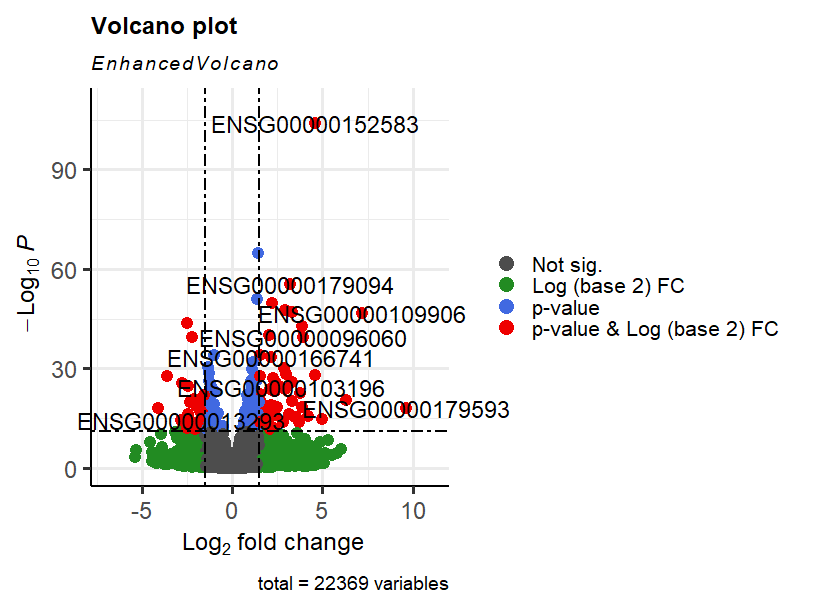

### Personal Statement 
A self-taught Computational Biomedical professional with background in Molecular Medicine and an extensive experince in Biomedical Research. 

### Education
Molecular Medicine and Translational Research, M.Sc. 

### Computaional Skills
R, Linux, Python
 
### Projects:

## RNAseq Pipeline

> - [Terminal commands](https://github.com/amenamahdami/Amena_Mahdami_Portfolio.github.io/blob/main/Shell/terminal%20commands.sh)
> - [Bash Scripts: RNAseq Pipeline](https://github.com/amenamahdami/Amena_Mahdami_Portfolio.github.io/blob/main/Shell/RNASeq_pipeline_BC.sh)

- RNAseq workflow in Bash
- RNAseq data generated by S Ishihara, et al. Sci Rep 2022 ([PMID: 35428832](https://pubmed.ncbi.nlm.nih.gov/35428832/) , [GEO: GSE186211](https://www.ncbi.nlm.nih.gov/geo/query/acc.cgi?acc=GSE186211))
- The MDA-MB-231 cells were infected with lentiviral particles that carried either a control shRNA (shNT) or GPR81-specific shRNA
- start with fastq reads, process these reads to get the count matrix
- First I extract fastq files using SRA toolkit
- RNAseq pipeline steps:
  1. Run QC on read using FastQC
  2. Mapping of reads to genome using HISAT2
  3. Reads quantification using featureCounts
- Results from the run: [test_counts.summary](https://github.com/amenamahdami/Amena_Mahdami_Portfolio.github.io/blob/main/Shell/test_counts.summary) , [RNA-seq counts matrix](https://github.com/amenamahdami/Amena_Mahdami_Portfolio.github.io/blob/main/Shell/sample_counts.tsv)

## Differential Gene Expression Analysis using DESeq2
> - R Scripts: [Getting Data](https://github.com/amenamahdami/Amena_Mahdami_Portfolio.github.io/blob/main/R/getData_airway.r) , [Running Analysis](https://github.com/amenamahdami/Amena_Mahdami_Portfolio.github.io/blob/main/R/DESeq2_workflow_airway.R)

- RNAseq data generated by BE Himes, et al. PLoS One 2014 ([PMID: 24926665](https://pubmed.ncbi.nlm.nih.gov/24926665/) , [GEO: GSE52778](https://www.ncbi.nlm.nih.gov/geo/query/acc.cgi?acc=GSE52778))
- In this project I use RNA-seq counts matrix from smooth muscle cell lines to identify genes that have diffrential gene expression patterns.
- RNAseq performed in human primary Airway Smooth Muscle cell lines which are treated with Dexamethasone (1 µM for 18 hours), which is used for asthma patietnts to reduce inflamation in the airways.
- Objective of project: Characterize Differential Gene Expressions between treated and untreated, to understand the transcriptional changes occuring due to treatment with Dexamethasone.
- Workflow steps:
  1. Read the data and get it in the right format
  2. Create DESeq dataset object
  3. Run the DESeq()
  4. Explore and visualize results

  
## Heart Disease Prediction
> - [Python Script](https://github.com/amenamahdami/Amena_Mahdami_Portfolio.github.io/blob/main/Python/ML_Project_Heart_Disease_Prediction.ipynb)

- In this project I use publicly available Heart Disease Dataset from [kaggle](https://www.kaggle.com/datasets/johnsmith88/heart-disease-dataset), to predict heart disease incident.
- The first part of the project I perform Data Wrangling and Exploration.
- In the second part I use Machine Learning to predict wether a patient is having high risk of heart disease or not.

#### Resources, References & Training:
<h6>
 

- [HISAT2 Manual](https://daehwankimlab.github.io/hisat2/manual/)  
- [featureCounts](https://rnnh.github.io/bioinfo-notebook/docs/featureCounts.html)
- [FastQC](https://www.bioinformatics.babraham.ac.uk/projects/fastqc/)
- [Linux/Unix Command Cheat Sheet](https://rumorscity.com/2014/08/16/6-best-linuxunix-command-cheat-sheet/)
- [Bioconductor](https://www.bioconductor.org/help/education-training/)
- [DESeq2 package](https://bioc.ism.ac.jp/packages/2.14/bioc/vignettes/DESeq2/inst/doc/beginner.pdf)
- [DESEQ2 R Tutorial](https://lashlock.github.io/compbio/R_presentation.html)
- [Python Data Science Handbook](https://jakevdp.github.io/PythonDataScienceHandbook/)
- [scikit-learn Machine Learning in Python](https://scikit-learn.org/stable/)
- [scikit-learn Classifier comparison](https://scikit-learn.org/stable/auto_examples/classification/plot_classifier_comparison.html#sphx-glr-auto-examples-classification-plot-classifier-comparison-py)
- [Google Data Analytics Certificate](https://coursera.org/share/0dd196ce17876b5d71ccc0c4695b738f) 

 6</h6>
